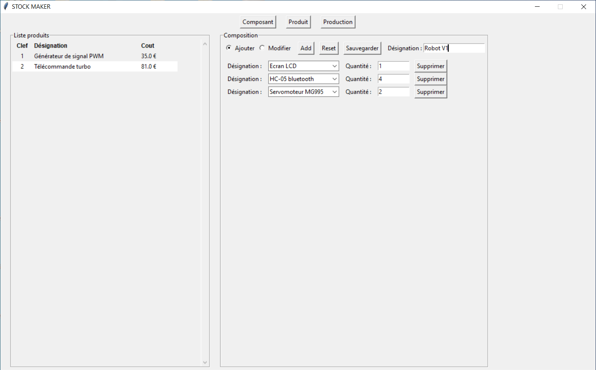

# Introduction

**```Stock Maker```** is a free inventory management software. All data are saved **```locally```** on your machine

Stock Maker is not just that. It is also a way to **```create products```** from stock components. Stock Maker allows you to see in a simple and efficient way if you have the **```necessary components in stock```** as well as to **```calculate the cost```** of the products you want to manufacture

## Component


The first feature of Stock Maker is to allow you simplicity in **```managing your component stock```**.

You will find in the lower part a **```list```** of all your components.

On the higher part, you can either **```add```** or **```modify```** it.

Each component has **```description```** **```comment```** **```quantity```** **```unit price```** **```datasheet```** **```shopping site```**

## Product



The product menu allows you to **```create```** new product from your components.

At the right, you can either **```add```** or **```modify```** it.

Each product has **```description```** **```list of components```**

You are able to see **```at a glance```** the **```cost```** of each product

## Production


The production menu allows you to select the products you wish to produce. Stock Maker will **```automatically```** give you the **```components needed```** for this production. It will also give you if you are ```**missing components**``` as well as the **```total costs of production```** and the **```lack of component```**
